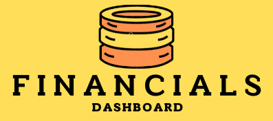

<p align="center">  </p>

&nbsp;&nbsp;&nbsp;&nbsp;&nbsp;&nbsp;&nbsp;&nbsp;&nbsp;&nbsp;&nbsp;&nbsp;&nbsp;&nbsp;&nbsp;&nbsp;&nbsp;&nbsp;&nbsp;

## Quick Links

<div align="center">

• [DEPLOYED SITE](https://mazzilio-finance-dashboard.vercel.app/) •

</div>

<br />

# 👨‍💻 Tech stack

This project follows the classic [MERN Stack](https://www.mongodb.com/mern-stack). This is an incredible stack to use for junior developers, or those looking to develop and understand their web development skills in a full-stack context.

Further details about the chosen stack and libraries:

<details > 
<summary> Frontend</summary>

-   This project uses the [React Library](https://react.dev/) with [Vite.js](https://vitejs.dev) as the development environment.
-   [Material UI](https://mui.com/) as the component library, the theme has been customised and expanded, alongside the usage of MUI icons.
-   This dashboard uses the font ["Montserrat"](https://fonts.google.com/specimen/Montserrat) as its main font and a custom colour scheme from [Coolors]("https://coolors.co/") palette generator.
-   [Recharts.js](https://recharts.org/en-US/) as the charting library, which uses React and [D3](https://d3js.org/) (Data Visualisation Library) to make customised and bespoke charts based on the open source data.
-   [Regression.js](https://github.com/tom-alexander/regression-js) to look at historical data and to create a prediction (aka regression line). This is an accessible way of learning some basic Machine Learning. :)
-   [Redux](https://redux-toolkit.js.org/) toolkit as a way to [manage state](https://www.freecodecamp.org/news/what-is-redux-store-actions-reducers-explained/) for JavaScript/TypeScript applications. \***_For future use, I recommend using React's Context API unless you want to learn how Redux works._**

</details>

<details > 
<summary> Backend</summary>

-   This project uses [Express](https://expressjs.com/) as a minimalist Node.js framework to create the API endpoints and insert the data into our database.
-   [MongoDB](https://www.mongodb.com/) has been used as NoSQL database to store JSON Objects and a chance to a flexible and more scalable database (if you want!).
-   [Mongoose](https://github.com/Automattic/mongoose) to insert, retrieve and work with MongoDB as an async modelling and database 'connection' tool.
-   [Nodemon](https://github.com/remy/nodemon), which is a monitoring script that checks for changes in your node.js app and then restarts the server for development purposes.
</details>
<br/>

This project has been hosted using [Vercel](https://vercel.com) and [Render](https://render.com/), as they are accessible and free hosting services for web apps and APIs.

# What is this dashboard for?

This was an exercise for me to learn how to use a data visualisation and charts library with some example data I was given to by an acquaintance. The aim was to learn how to manage a global state for several API calls, feed them through to the relevant components, and customise a variety of charts by leveraging Recharts and MUI.

This was also an opportunity for me to learn and leverage MUI and customising the existing components and colour palette. I really enjoyed working on my TypeScript skills and backend work too as I am more versed in JavaScript and classic web development.

# 🌟 What's next?!

This is version 1.0 of this dashboard. My intention is to further build on top of this and to further refine my understanding and development for fullstack applications and data visualisation. As part of this, my current goals for this project is as follows:

-   Further customise the MUI Components to be reusable through further component theme extensions.
-   Use a more mobile friendly charts and data visualisation library, as Recharts sometimes does not interact well with smaller screens.
-   Create an authentication flow for users to log in with using Auth0.
-   Test, test, test my code!! (Integration and unit testing).
-   Create solid CI/CD approaches, including Git hooks, pipelines, code coverage checks and code formatting checks.

This is a lot to add in terms of further steps, but I would like this to be a good example of code and approaches to be used by others. :D

---

## API Endpoints

-   [/kpi/kpis](https://mazzilio-financer-backend.onrender.com/kpi/kpis)
-   [/product/products](https://mazzilio-financer-backend.onrender.com/product/products/)
-   [/transaction/transactions](https://mazzilio-financer-backend.onrender.com/transaction/transactions)

## Want to run it locally?

Feel free to download and use this code for your own portfolios and examples of MERN Project. To run the project you simply have to do the following:

1. **Run your web app locally** - you'll see 404 on your network requests as the backend isn't running yet!

```bash
cd client
npm install
npm run dev
```

2. **Run the server locally** - make sure to have your specified port in your environment variables to get the data!

```bash
cd server
npm install
npm run dev
```

All configuration files have been set up based on relevant documentation and experience, but feel free to tinker around with the Tailwind configurations and stylings as a learning exercise.

## Notes

This piece of work has not been unit tested as of now, but code coverage and unit tests will be addressed once an opportunity arises for me to focus on it. I am intending to further work on this with learnings and improvements as highlighted in the stretch goals above.

---

# Pathways into Tech?

I was very fortunate enough to have done the [Code First Girls](https://codefirstgirls.com/courses/cfgdegree/) Bootcamp with an opportunity to interview at an amazing company. Before then, I undertook a lot of web development courses, such as the FreeCodeCamp Legacy and Updated Web Dev courses, the Full-stack Route on Codecademy, and a ton of YouTube tutorials and Medium Articles!

My focus has been on project-based learning and undertaking Computer Science fundamentals. I have a ton more content on my TikTok on my own experience and journey, so feel free to connect on there!

# ✍️ Contributing

If you would like to contribute feedback, improvements or make your own version - this code is available for you to clone and use for your own projects and developments.

# ⚠️ License

My code is free and open-source under the GNU General Public License v3.0.
